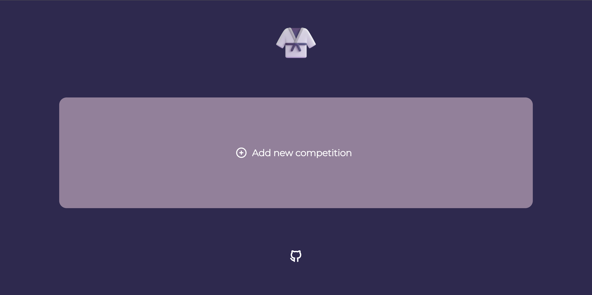
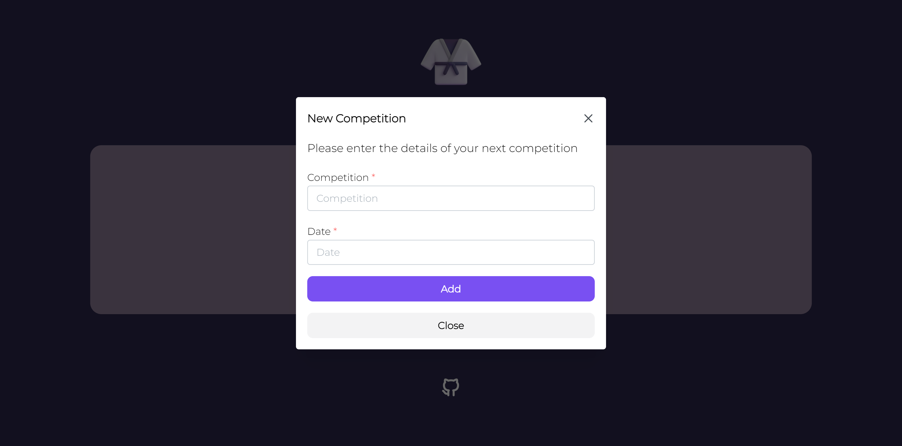
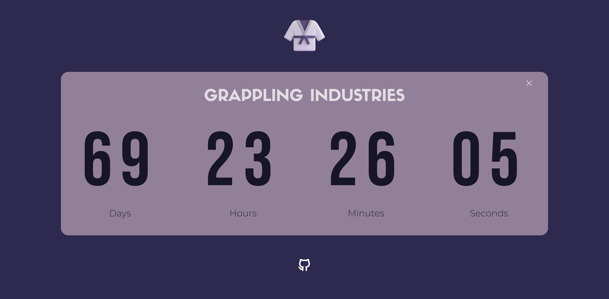
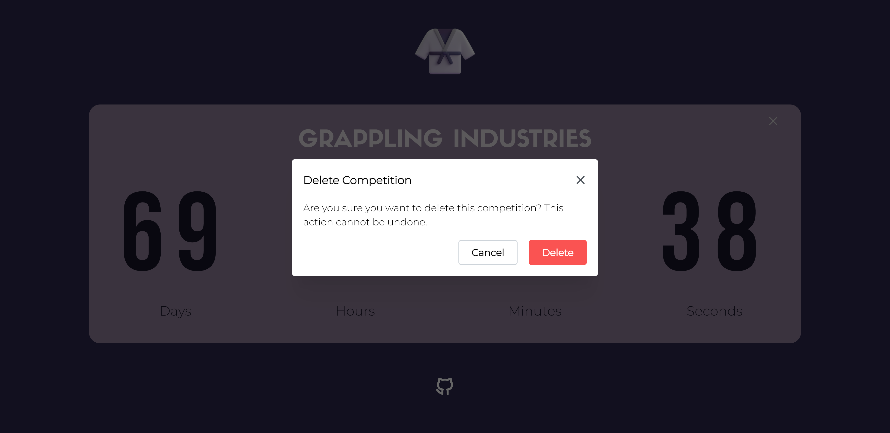

# 🥋 BJJ Countdown

👋 **Welcome to BJJ Countdown**: a ReactJS web application to track your upcoming Brazilian Jiujitsu (BJJ) competitions! ⏳🥋

## How to Use

1. Access the web application by visiting https://bjj-countdown.netlify.app/.
   
2. Click "Add new competition" and enter the name and date of your next BJJ competition.
   
3. See the countdown begin!
   
4. The countdown can be deleted and a new one added
   

## Contributions & Feedback

I welcome your feedback and contributions to this project!

If you have any suggestions, ideas, or bug reports, please feel free to submit a [GitHub issue](https://github.com/henrylin03/bjj-countdown/issues).
