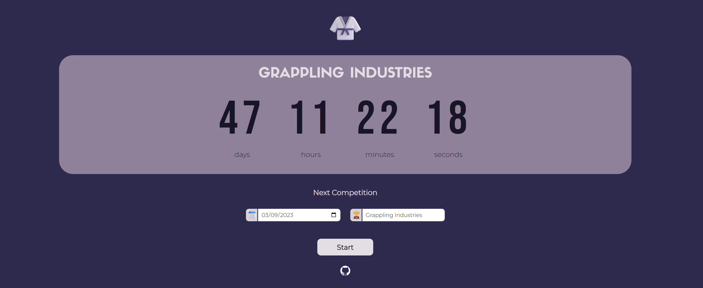

# 🥋 BJJ Countdown

👋 **Welcome to BJJ Countdown**: a fun and useful way to track your upcoming BJJ competitions! ⏳🥋

## Technologies Used

🌟 **HTML**: to create a well-structured and semantic web page.

🎨 **CSS**: deliver aesthetically pleasing and responsive design, ensuring optimal user experience across various devices.

💻 **JavaScript**: implemented interactive features including user input validation, countdown calculations, and dynamic updates to the DOM.

## How to Use

1. Access the web application by visiting https://bjj-countdown.netlify.app/.
2. Enter the date and name (optional) of your next BJJ competition in the provided fields.
3. Click the "**Start Countdown**" button to initiate the countdown timer.

## Contributions & Feedback

I welcome your feedback and contributions to this project! If you have any suggestions, ideas, or bug reports, please feel free to submit a [GitHub issue](https://github.com/henrylin03/bjj-countdown/issues).
